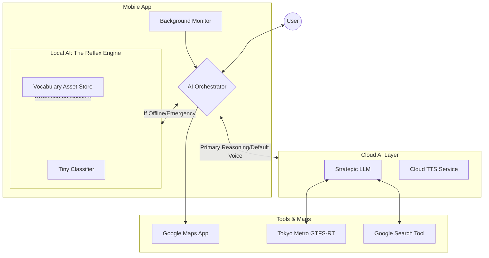
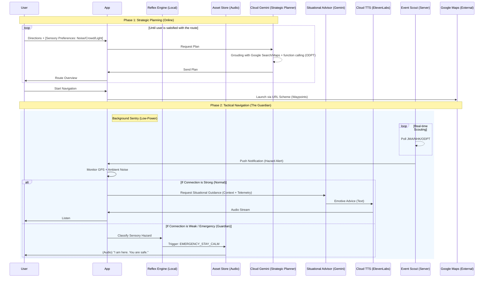

# Service Architecture: Pocket Secure Base

## 1. System Overview
Pocket Secure Base is a mobile-first platform that leverages Large Language Models (LLMs) and real-time environmental data to provide sensory-aware navigation and support for individuals with developmental disorders.

## 2. High-Level Component Diagram
The following diagram illustrates the Agentic workflow where the LLM acts as the central decision-maker, utilizing tools to gather environmental context.

---

## 3. Hybrid Intelligence Lifecycle: Planning & Intervention
The system operates on a "Strategic Cloud, Tactical Local" model. The Cloud AI handles the heavy planning and script generation, while the Local AI handles real-time execution and safety interventions.

---

## 4. Core Architectural Components

### A. The "Hybrid" Choice-Driven Intelligence Model
To balance advanced reasoning with device efficiency and immediate safety:
- **Cloud LLM (The Strategic Planner)**: An agentic model (Gemini 2.0 Flash) that handles complex route planning and deep situational analysis. It pre-writes "Gold Standard" scripts for the local engine.
- **Local AI (The Reflex Engine)**: A lightweight, high-performance on-device classifier.
  - **Role**: Provides sub-second, offline-capable interventions by matching sensor data (GPS/Noise) to pre-recorded vocabulary assets.
  - **Asset Store**: A library of human-voiced "Social Worker" interventions and grounding exercises stored locally to ensure 100% reliability without internet.

### B. LLM Tool Use (Function Calling)
The Cloud LLM is equipped with specialized tools to interpret the real world:
1.  **Tokyo Metro GTFS-RT (ODPT)**: Checks for train delays and platform crowding.
2.  **Google Search Tool**: Searches for local events or construction that might cause sensory triggers.

### C. Background Monitoring & Safety
- **Google Maps Integration**: Launches the native maps app for navigation while maintaining background monitoring.
- **Geofencing**: Triggers haptic or voice interventions when approaching high-stress areas identified in the planning phase.
- **Offline-First Panic Layer**: Ensures the "Digital Social Worker" remains available even in subterranean transit environments.

---

## 5. Technical Infrastructure & Data Sources

### A. Navigation & Locations
- **URL Scheme Routing**: Core pathfinding via Google Maps app with specific tactical waypoints.
- **Search-Based Place Discovery**: Extraction of sensory metadata (quiet levels, lighting) from public reviews.

### B. Real-Time Data Sources (Tools)
- **Tokyo Metro GTFS-RT (ODPT)**: Real-time transit information.
- **Google Search Tool**: Real-time identification of large-scale events and sudden noise pollution.
