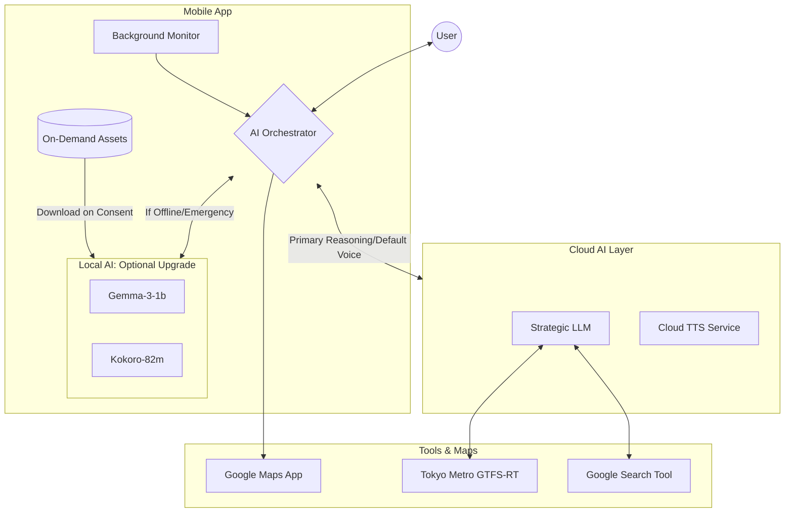

# Service Architecture: Pocket Secure Base

## 1. System Overview
Pocket Secure Base is a mobile-first platform that leverages Large Language Models (LLMs) and real-time environmental data to provide sensory-aware navigation and support for individuals with developmental disorders.

## 2. High-Level Component Diagram
The following diagram illustrates the Agentic workflow where the LLM acts as the central decision-maker, utilizing tools to gather environmental context.

---

## 3. Core Architectural Components

### A. The "Hybrid" Choice-Driven Intelligence Model
To balance advanced reasoning with device efficiency and immediate safety:
- **Cloud LLM (The Strategic Planner)**: An agentic model (e.g., Gemini Cloud/GPT-4) that handles complex route planning and deep situational analysis using real-time external tools. It is the default intelligence layer for all users.
- **Local AI (The Tactical Guardian)**: A high-performance, on-device stack consisting of **gemma-3-1b** (Reasoning) and **Kokoro-82m** (TTS). 
  - **Optional Activation**: This is an "Offline Safety Upgrade" that users must explicitly consent to.
  - **Role**: Provides sub-second, offline-capable verbal feedback based on immediate GPS coordinates and ambient noise from the microphone. It serves as the primary intelligence when the internet connection is weak or the support is time-sensitive (e.g., sudden loud noises).
  - **Asset Management**: Models are downloaded on-demand (approx. 800MB–1.5GB) to keep the initial app size small and prevent uninstalls related to storage bloat.

### B. LLM Tool Use (Function Calling)
The Cloud LLM is equipped with specialized tools to interpret the real world:
1.  **Tokyo Metro GTFS-RT (ODPT)**: The LLM checks for train delays, platform crowding, and station status when planning transit routes.
2.  **Google Search Tool**: The LLM searches for local events, festivals, or construction news that might cause sudden noise or crowd surges.
3.  **Dynamic Reasoning**: By using these as tools, the LLM can perform iterative searches (e.g., "If Line A is crowded, let me check the status of Line B").

### C. Background Monitoring & Safety
The app maintains a "Secure Base" even when not in the foreground:
- **Google Maps Integration**: The app launches the system's Google Maps app for turn-by-turn navigation but continues to monitor the user's state in the background.
- **Geofencing**: Uses background GPS tracking to trigger "Interventions" (Haptics or Voice) when approaching high-stress areas identified in the planning phase.
- **Offline-First Panic Layer**: Stores "One-Tap Home" coordinates and sensory relaxation assets locally to ensure the panic button works without internet.

---

## 4. Technical Infrastructure & Data Sources

### A. Navigation & Locations
- **URL Scheme Routing**: Core pathfinding by launching native Google Maps app with specific waypoints for quiet/safe routes.
- **Search-Based Place Discovery**: The LLM uses the Google Search Tool to identify "Safe Havens" (cafes, libraries, parks) and extract sensory metadata from public reviews and descriptions.

### B. Real-Time Data Sources (Tools)
- **Tokyo Metro GTFS-RT (ODPT)**: Real-time transit information via the [Open Data Challenge for Public Transportation in Japan](https://ckan.odpt.org/dataset/r_train_gtfs_rt-odpt_train-tokyometro).
- **Google Search Tool**: Real-time identification of large-scale events, construction, or sudden noise pollution via search-driven intelligence.
