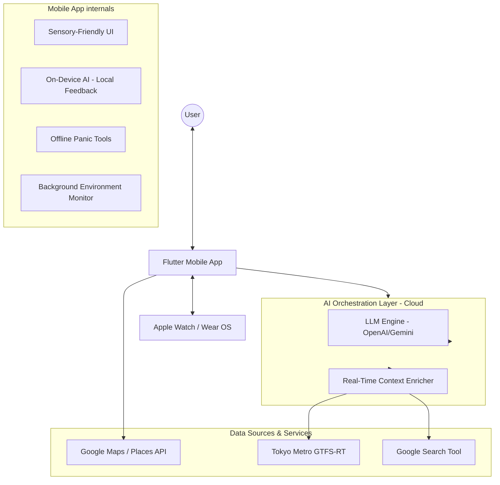

# Service Architecture: Pocket Secure Base

## 1. System Overview
Pocket Secure Base is a mobile-first platform that leverages Large Language Models (LLMs) and real-time environmental data to provide sensory-aware navigation and support for individuals with developmental disorders.

## 2. High-Level Component Diagram
The following diagram illustrates the interaction between the mobile app, the AI orchestration layer, and external data sources.

---

## 3. Core Architectural Components

### A. The "Hybrid" Intelligence Model
To balance advanced reasoning with immediate safety:
- **Cloud LLM (The Planner)**: Handles complex, multi-variable route planning (e.g., "Find a route from Shinjuku to Ginza that avoids the 5 PM rush and major construction"). This occurs during the initial journey request.
- **Local AI (The Guardian)**: A lightweight, on-device model (e.g., quantized TFLite) providing immediate verbal feedback based on real-time GPS coordinates and ambient noise from the microphone, ensuring functionality even in "dead zones."

### B. The Cloud Context Enricher
A centralized orchestrator (e.g., Firebase Functions or Node.js service) acts as a single endpoint for the mobile app:
1.  **Request Aggregation**: Parallelizes requests to **ODPT** (train delays) and **Google Search Tool** (identifying events or noisy zones).
2.  **Context Injection**: Feeds this real-time data into the **LLM** as a system prompt.
3.  **Sensory Mapping**: Returns a structured "Sensory Map" to the app, highlighting potential stress zones.

### C. Background Monitoring & Safety
The app maintains a "Secure Base" even when not in the foreground:
- **Google Maps Integration**: The app launches the system's Google Maps app for turn-by-turn navigation but continues to monitor the user's state in the background.
- **Geofencing**: Uses background GPS tracking to trigger "Interventions" (Haptics or Voice) when approaching high-stress areas identified in the planning phase.
- **Offline-First Panic Layer**: Stores "One-Tap Home" coordinates and sensory relaxation assets locally to ensure the panic button works without internet.

---

## 4. Technical Infrastructure & Data Sources

### A. Navigation & Locations
- **Google Maps SDK / Route API**: Core map rendering and pathfinding for quiet/safe routes.
- **Google Places API**: Identifying and filtering "Safe Havens" and nearby points of interest.

### B. Real-Time Data Sources
- **Tokyo Metro GTFS-RT (ODPT)**: Real-time transit information via the [Open Data Challenge for Public Transportation in Japan](https://ckan.odpt.org/dataset/r_train_gtfs_rt-odpt_train-tokyometro).
- **Google Search Tool**: Real-time identification of large-scale events, construction, or sudden noise pollution via search-driven intelligence.
