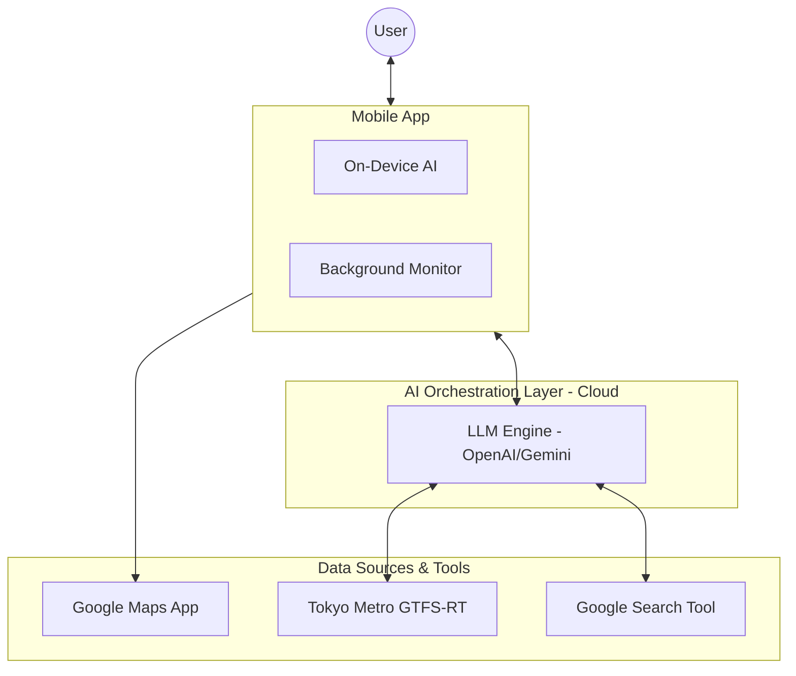

# Service Architecture: Pocket Secure Base

## 1. System Overview
Pocket Secure Base is a mobile-first platform that leverages Large Language Models (LLMs) and real-time environmental data to provide sensory-aware navigation and support for individuals with developmental disorders.

## 2. High-Level Component Diagram
The following diagram illustrates the Agentic workflow where the LLM acts as the central decision-maker, utilizing tools to gather environmental context.

---

## 3. Core Architectural Components

### A. The "Hybrid" Intelligence Model
To balance advanced reasoning with immediate safety:
- **Cloud LLM (The Planner)**: An agentic model that handles complex route planning. It proactively uses tools (ODPT, Google Search) to investigate the user's path for sensory triggers before suggesting a route.
- **Local AI (The Guardian)**: A lightweight, on-device model (e.g., quantized TFLite) providing immediate verbal feedback based on real-time GPS coordinates and ambient noise from the microphone, ensuring functionality even in "dead zones."

### B. LLM Tool Use (Function Calling)
The Cloud LLM is equipped with specialized tools to interpret the real world:
1.  **Tokyo Metro GTFS-RT (ODPT)**: The LLM checks for train delays, platform crowding, and station status when planning transit routes.
2.  **Google Search Tool**: The LLM searches for local events, festivals, or construction news that might cause sudden noise or crowd surges.
3.  **Dynamic Reasoning**: By using these as tools, the LLM can perform iterative searches (e.g., "If Line A is crowded, let me check the status of Line B").

### C. Background Monitoring & Safety
The app maintains a "Secure Base" even when not in the foreground:
- **Google Maps Integration**: The app launches the system's Google Maps app for turn-by-turn navigation but continues to monitor the user's state in the background.
- **Geofencing**: Uses background GPS tracking to trigger "Interventions" (Haptics or Voice) when approaching high-stress areas identified in the planning phase.
- **Offline-First Panic Layer**: Stores "One-Tap Home" coordinates and sensory relaxation assets locally to ensure the panic button works without internet.

---

## 4. Technical Infrastructure & Data Sources

### A. Navigation & Locations
- **URL Scheme Routing**: Core pathfinding by launching native Google Maps app with specific waypoints for quiet/safe routes.
- **Search-Based Place Discovery**: The LLM uses the Google Search Tool to identify "Safe Havens" (cafes, libraries, parks) and extract sensory metadata from public reviews and descriptions.

### B. Real-Time Data Sources (Tools)
- **Tokyo Metro GTFS-RT (ODPT)**: Real-time transit information via the [Open Data Challenge for Public Transportation in Japan](https://ckan.odpt.org/dataset/r_train_gtfs_rt-odpt_train-tokyometro).
- **Google Search Tool**: Real-time identification of large-scale events, construction, or sudden noise pollution via search-driven intelligence.
