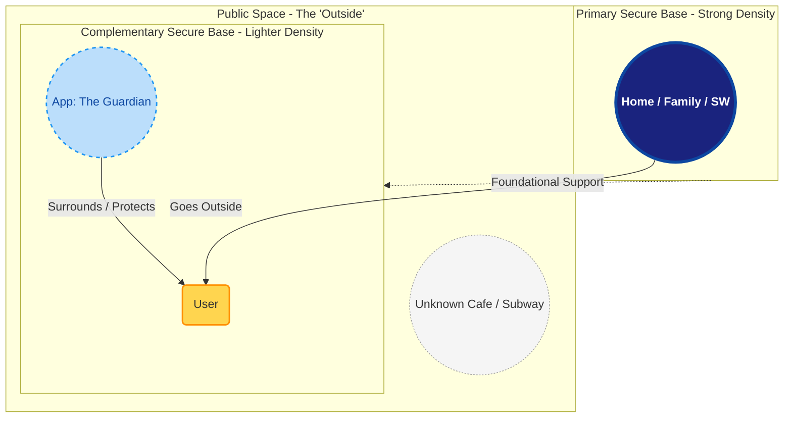

# Concept: The Digital Secure Base

## 1. Social Welfare and the Secure Base
Social welfare for neurodivergent people is primarily constructed by social workers who try to support them by respecting their fundamental human rights. These social workers physically communicate with these people. By communicating in such a way, disabled people get a **Secure Base** (as stated by John Bowlby)—a foundation of safety provided by family, home, school, the office, and so on. 

This app is trying to provide a **complementary secure base** while they go outside, extending that safety into the unpredictable public environment.

---

## 2. Visualization: Primary vs. Complementary
This diagram represents the user's landscape of safety. The **Primary Secure Bases** (Home, Social Workers) are fixed points of high-density support, while the **Complementary Secure Base** (the App) follows the user, providing a lighter but constant layer of safety.

## 3. The App's Role
- **Primary Base (Anchor)**: Provides long-term stability and human connection.
- **Complementary Base (Bridge)**: Provides real-time "Guardian" support, noise monitoring, and tactical advice, acting as a portable extension of the primary anchor when the user is in transition.