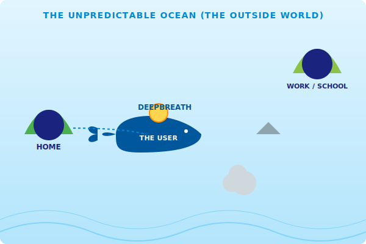

# Concept: The Navigator Whale

## 1. Social Welfare and the Secure Base
Social welfare for neurodivergent people is primarily constructed by social workers who try to support them by respecting their fundamental human rights. These social workers physically communicate with these people. By communicating in such a way, disabled people get a **Secure Base** (as stated by John Bowlby)—a foundation of safety provided by family, home, school, the office, and so on.

## 2. Metaphor: The Whale in the Unpredictable Ocean
While a "Secure Base" is often imagined as a fixed location (Home or Office), the real world—the space between these islands—is as unpredictable and vast as the ocean.

For a neurodivergent individual, navigating this "ocean" can be overwhelming. Sudden "Sensory Storms" (loud noises) or "Crowded Currents" (heavy traffic) can trigger anxiety and a loss of autonomy.

**The App is the Whale.**
The user "rides" on this whale to traverse the unpredictable ocean. The whale provides:
- **Reliability**: A powerful, calm presence that does not panic.
- **Predictability**: Using real-time data (ODPT, Google Search) to "see" through the waves and identify upcoming hazards.
- **Support**: Continuous verbal and haptic feedback (the "Voice of the Guardian") that acts as a steady heartbeat during the journey.

---

## 3. Visualization: The Safety Map
This map illustrates how the app serves as a mobile vessel of safety between fixed bases.

## 4. The App's Role
- **Islands of Safety (Anchors)**: Fixed locations like Home or School where the primary secure base exists.
- **The Navigator Whale (The Vessel)**: The digital secure base that carries the user, converting the unpredictable outside world into a manageable, predictable, and even comfortable journey.
