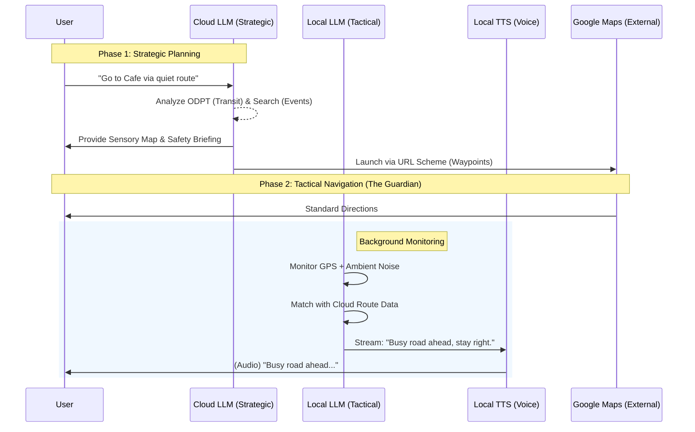

# Feature Specification: On-Device AI ("The Guardian")

## 1. Overview
"The Guardian" is the on-device intelligence layer of the Pocket Secure Base. It consists of two local AI models—a lightweight LLM for text generation and a high-quality TTS engine—working in tandem to provide immediate, offline-capable sensory support during navigation.

---

## 2. The Remote-to-Local Navigation Flow
The system operates on a "Strategic Cloud, Tactical Local" model. The Cloud AI handles the heavy planning, while the Local AI handles real-time execution and safety.

---

## 3. Core Models & Assets

### A. Local LLM (Sentence Generation)
- **Model Choice**: **Gemma 2B** (via LiteRT/MediaPipe) or **Gemini Nano** (AICore on Android flagships).
- **Role**: Takes raw environmental data (e.g., "Noise: 85dB," "Current Lat/Lng: Near Construction") and the Cloud AI's route metadata to generate human-like, calming advice.
- **Latency**: Sub-200ms Time-to-First-Token (TTFT) on modern NPU/GPU.

### B. Local TTS (Text-to-Speech)
- **Model Choice**: **Kokoro-82M** (via `sherpa-onnx`).
- **Role**: Transforms the text from the Local LLM into high-quality, natural audio.
- **Key Feature**: **Streaming Audio.** It begins synthesizing speech as the first tokens of the sentence are generated, ensuring zero-latency verbal feedback.

---

## 4. Performance & Reliability Constraints

| Metric | Target | Mitigation Strategy |
| :--- | :--- | :--- |
| **RAM Usage** | ~2.5 GB | Models are loaded only when a trip starts and purged when it ends. |
| **Latency** | < 800ms total | Parallel streaming: LLM token generation flows directly into the TTS buffer. |
| **Battery** | < 15%/hr | Offload to NPU (Neural Processing Unit) or GPU whenever possible. |
| **Reliability** | 100% Offline | Both models and their weights are bundled as app assets. |

## 5. Why the "Two-Model" Approach Matters
- **Emotional Calibration**: A standard "robot" voice can be a sensory trigger. The Local LLM crafts *gentle* sentences, and the high-quality TTS delivers them in a *calm* tone.
- **Privacy First**: Sensitive data about the user's immediate physical environment and stress levels never leave the device.
- **Immediate Intervention**: In a "Panic Mode" event, waiting for a cloud round-trip is not an option. The local assets ensure the "Secure Base" is always present, even in subway tunnels or dead zones.
