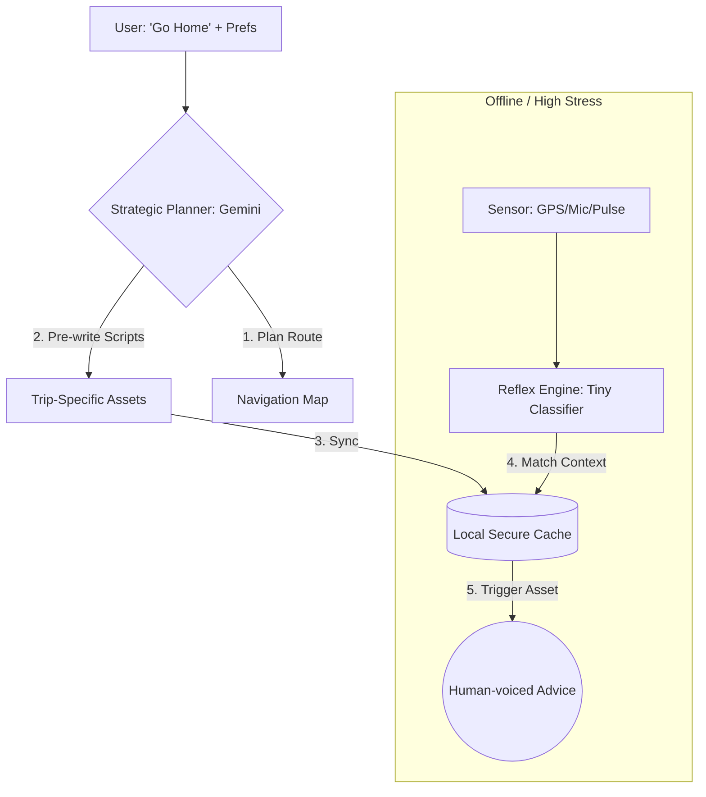

# Strategy: Local AI Enhancement (The "Reflex Engine" Model)

## 1. The Real-Time Crisis Challenge
To fulfill the role of the **"Guardian"** during a crisis (no internet, hazard, or sensory surge), the app must provide immediate, high-quality, and 100% reliable support. 

Rather than relying on a large-scale Local LLM (like Gemma), which can be slow and unpredictable, we use a **"Strategic Anticipation"** model. This strategy uses the Cloud's intelligence while online to "prepare" a local, lightning-fast **Reflex Engine**.

---

## 2. Core Enhancement Pillars

### A. The "Digital Pharmacy" (Asset-Based Retrieval)
Instead of generating new text during a crisis, the app utilizes a library of **High-Fidelity Vocabulary Assets**.
- **The Asset Store**: A local database of pre-recorded audio and text "scripts" voiced by human social workers.
- **Intelligent Classification**: A **Tiny Classifier** (~5-15MB) acts as the "Context Switcher." It analyzes sensor data (GPS, Mic, Pulse) to select the most appropriate `Asset_ID` from the pharmacy.
- **Benefit**: Ensures **zero hallucination**, human-level empathy, and near-instantaneous (sub-10ms) response times.

### B. Strategic Script Pre-caching
While the user is online, the **Strategic Planner (Cloud)** pre-writes specific guidance for the route.
- **Pre-Flight Generation**: Gemini 2.0 Flash creates "Gold Standard" verbal instructions for every potential waypoint and sensory trigger on the route.
- **Trip-Specific Sync**: These scripts are synced to the local device before the trip starts, effectively giving the Reflex Engine "trip-specific knowledge."

### C. Knowledge Distillation & Training
The "Tiny Classifier" is trained using the **Cloud AI as the Teacher**.
1.  **Generate Data**: Use **Gemini 2.0 Pro** to simulate 100,000+ emergency scenarios (e.g., "Subway accident, noise 110dB, heart rate 130bpm").
2.  **Label Interventions**: Professional social workers define the correct `Asset_ID` for each scenario.
3.  **Train Tiny Model**: Train a lightweight Multi-Layer Perceptron (MLP) or small Transformer-based classifier on this labeled dataset.
4.  **Runtime**: Convert to TFLite or CoreML for zero-latency execution.

---

## 3. Data Flow for "Reflex Navigation"

---

## 4. Analogy: The Local AI as a "Digital Social Worker"

In an emergency, a human social worker doesn't need "super-intelligence"; they need **predictability, calm, and focus.** Our Reflex Engine architecture mimics this behavior:

| Human Intervention | Digital Equivalent | Technical Benefit |
| :--- | :--- | :--- |
| **Calm Tone** | **Human-voiced Assets** | Biologically signals safety via prosody. |
| **Simple Directions** | **Low-demand Scripts** | Replaces lost "Internal Pilot" (planning ability). |
| **Focus on Focus** | **Mic + Haptics** | Helps user filter out overwhelming noise. |
| **Immediate Support** | **Sub-10ms Inference** | Prevents paralysis through instant feedback. |

---

## 5. Summary
By shifting from "Local Generation" to **"Intelligent Local Retrieval,"** we ensure the **Pocket Secure Base** provides a professional-grade "Social Worker" presence that is fast, safe, and emotionally resonant—even when the world is in chaos and the internet is gone.
