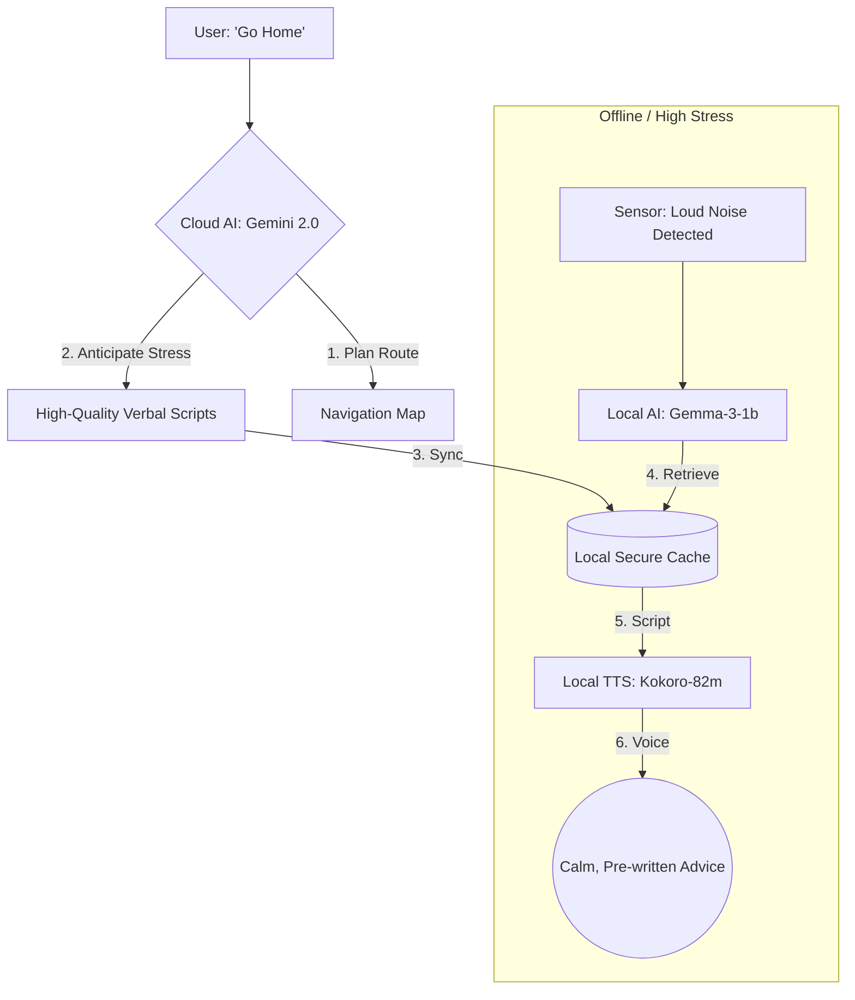

# Strategy: Local AI Enhancement (The "Strategic Anticipation" Model)

## 1. The Quality Gap Challenge
The **Local AI (Gemma-3-1b)** has inherent constraints in reasoning depth and linguistic nuance compared to the **Cloud AI (Gemini 2.0 Flash/Pro)**. However, the Local AI is most critical during **emergencies, offline transit (subways), or sensory surges** when internet connectivity is unreliable.

To solve this, we use a **"Cloud-to-Local Distillation"** strategy: we use the Cloud's power while online to "prepare" the Local AI for the worst-case scenario.

---

## 2. Core Enhancement Pillars

### A. Strategic Script Caching (The "Offline Reservoir")
Instead of forcing the 1B model to "think" during a panic, we pre-generate high-quality guidance while the user is still online.
- **The "Pre-Flight" Check**: When the Strategic Planner generates a route, it creates a **Sensory Map JSON** containing "Gold Standard" verbal instructions written by the Cloud AI for every potential trigger.
- **Execution**: If the device goes offline, the Local AI simply retrieves these pre-written, empathetic scripts instead of generating its own text.
- **Benefit**: The user receives "Pro-level" verbal comfort even with zero bars of signal.

### B. Knowledge Distillation (Fine-Tuning Gemma)
We will bridge the "intelligence gap" by fine-tuning the **Gemma-3-1b** model specifically for the **Pocket Secure Base** persona.
- **Dataset**: Use Gemini 2.0 Pro to generate 5,000+ examples of supportive, calm, and navigation-focused dialogue in Japanese and English.
- **Technique**: Apply **QLoRA (4-bit quantization)** to fine-tune the model to mimic the "Senior Social Worker" tone.
- **Result**: The local model becomes "personality-locked" to be calm, non-judgmental, and precise.

### C. The "Digital Pharmacy" (Asset-Based Retrieval)
Instead of relying on real-time text generation, which can be slow or inconsistent, the app utilizes a library of **High-Fidelity Vocabulary Assets**.
- **The Asset Store**: A local database of pre-recorded audio and text "scripts" (e.g., `GROUNDING_54321`, `EMERGENCY_STAY_CALM`) voiced by professional social workers.
- **Intelligent Classification**: The fine-tuned **Gemma-3-1b** acts as a **Context Switcher**. Its role is to analyze sensor data (GPS, Mic, Pulse) and select the most appropriate `Asset_ID` from the pharmacy.
- **Benefit**: Ensures **zero hallucination**, human-level empathy, and near-instantaneous response times during a crisis.

### D. Emotive TTS & Audio Blending
For dynamic information (like specific station names), the app uses **Kokoro-82m**. For core emotional support, it plays the **Pre-recorded Human Assets**. The system intelligently blends these two to maintain a consistent "Guardian" persona.

---

## 3. Data Flow for "Strategic Anticipation"

---

## 4. Implementation Priorities

1.  **Phase 1 (Syncing)**: Update the `Sensory Map JSON` schema to include `verbal_instruction_id` and `script_text`.
2.  **Phase 2 (Local DB)**: Implement a fast-retrieval local database for grounding exercises.
3.  **Phase 3 (Fine-Tuning)**: Collect "Golden Dataset" from Gemini 2.0 and begin 4-bit quantization of Gemma-3-1b.

---

## 5. Summary
By shifting the "heavy lifting" of reasoning to the **Online/Planning phase**, the **Local Guardian** transforms from a "small chatbot" into a **"High-Speed Emergency Player."** This ensures the user is never left with low-quality support when they are most vulnerable.

---

## 6. Analogy: The Local AI as a "Digital Social Worker"

In an emergency (like a subway hazard), a human social worker doesn't need "super-intelligence." They need **predictability, calm, and focus.** Our Local AI strategy mimics this behavior:

| Social Worker Intervention | Local AI Component | Why it works |
| :--- | :--- | :--- |
| **Calm Frequency** | **Kokoro-82m** (Low Pitch) | Biologically signals "Safe" to the nervous system. |
| **Low-Demand Scripts** | **Pre-cached Scripts** (Flash/Pro) | Replaces lost "Internal Pilot" (planning ability). |
| **Sensory Filtering** | **Mic Sensors + Haptics** | Helps user focus on a "Sensory Bubble" instead of chaos. |
| **Next Three Steps** | **Offline Micro-Waypoints** | Provides tiny, achievable goals to prevent paralysis. |

### The "Words as Medicine" Principle
The Local AI's primary job is not to "solve" the technical problem, but to **provide the voice that keeps the user regulated.** By caching high-quality "Social Worker" scripts while online, the app ensures that the "medicine" is always in the user's pocket, even when the internet is gone.

