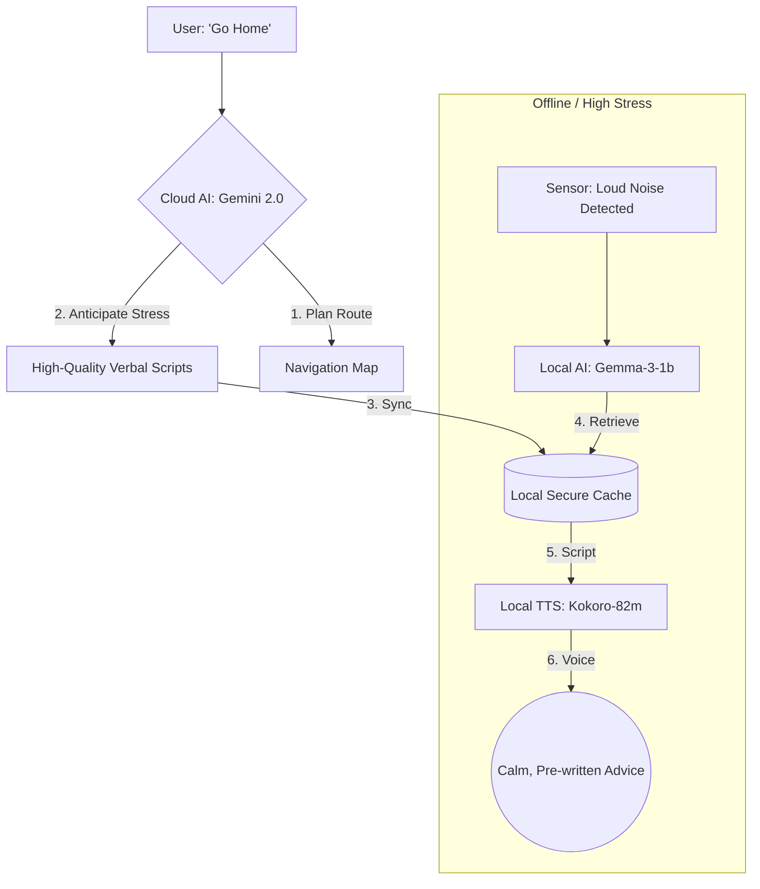

# Strategy: Local AI Enhancement (The "Strategic Anticipation" Model)

## 1. The Quality Gap Challenge
The **Local AI (Gemma-3-1b)** has inherent constraints in reasoning depth and linguistic nuance compared to the **Cloud AI (Gemini 2.0 Flash/Pro)**. However, the Local AI is most critical during **emergencies, offline transit (subways), or sensory surges** when internet connectivity is unreliable.

To solve this, we use a **"Cloud-to-Local Distillation"** strategy: we use the Cloud's power while online to "prepare" the Local AI for the worst-case scenario.

---

## 2. Core Enhancement Pillars

### A. Strategic Script Caching (The "Offline Reservoir")
Instead of forcing the 1B model to "think" during a panic, we pre-generate high-quality guidance while the user is still online.
- **The "Pre-Flight" Check**: When the Strategic Planner generates a route, it creates a **Sensory Map JSON** containing "Gold Standard" verbal instructions written by the Cloud AI for every potential trigger.
- **Execution**: If the device goes offline, the Local AI simply retrieves these pre-written, empathetic scripts instead of generating its own text.
- **Benefit**: The user receives "Pro-level" verbal comfort even with zero bars of signal.

### B. Knowledge Distillation (Fine-Tuning Gemma)
We will bridge the "intelligence gap" by fine-tuning the **Gemma-3-1b** model specifically for the **Pocket Secure Base** persona.
- **Dataset**: Use Gemini 2.0 Pro to generate 5,000+ examples of supportive, calm, and navigation-focused dialogue in Japanese and English.
- **Technique**: Apply **QLoRA (4-bit quantization)** to fine-tune the model to mimic the "Senior Social Worker" tone.
- **Result**: The local model becomes "personality-locked" to be calm, non-judgmental, and precise.

### C. Local RAG (The "Safety Handbook")
A small, high-speed local database (e.g., Isar or SQLite) stores a library of **Grounding Exercises** and **Safety Protocols**.
- **Vector Search**: When a "Hazard" or "Sensory Surge" is detected via sensors (Pulse/Mic), the Local AI performs a local vector search to find the most appropriate grounding technique (e.g., "5-4-3-2-1 Technique").
- **Benefit**: Instructions are medically and psychologically sound, rather than "hallucinated" by a small model under pressure.

### D. Emotive TTS Voice Packs (Kokoro-82m)
We optimize the local voice to match the user's emotional state.
- **"Calm Guardian" Pack**: Weights optimized for low-pitch, steady-rhythm speech to reduce anxiety.
- **"Clear Direction" Pack**: Optimized for high-clarity pronunciation in noisy environments (e.g., train platforms).

---

## 3. Data Flow for "Strategic Anticipation"

---

## 4. Implementation Priorities

1.  **Phase 1 (Syncing)**: Update the `Sensory Map JSON` schema to include `verbal_instruction_id` and `script_text`.
2.  **Phase 2 (Local DB)**: Implement a fast-retrieval local database for grounding exercises.
3.  **Phase 3 (Fine-Tuning)**: Collect "Golden Dataset" from Gemini 2.0 and begin 4-bit quantization of Gemma-3-1b.

---

## 5. Summary
By shifting the "heavy lifting" of reasoning to the **Online/Planning phase**, the **Local Guardian** transforms from a "small chatbot" into a **"High-Speed Emergency Player."** This ensures the user is never left with low-quality support when they are most vulnerable.
