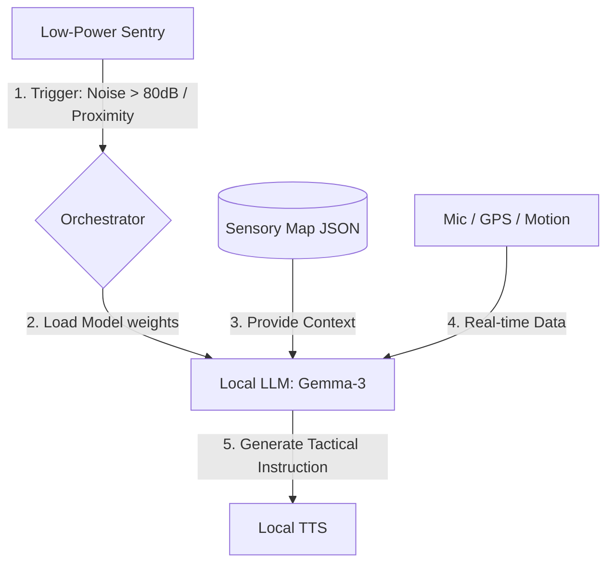

# Local AI Architecture: The Local Guardian (LLM)

## 1. Role & Objective
The Local LLM is the **Tactical Intelligence** layer of the Pocket Secure Base. Its primary objective is to provide immediate, offline-capable reasoning and intervention when the user encounters sensory triggers or loses internet connectivity.

It acts as the "Heavy" intelligence that is woken up by the low-power **Sentry** monitor.

---

## 2. Technical Stack
- **Model**: `gemma-3-1b` (Quantized to 4-bit/GGUF).
- **Runtime**: `onnxruntime_flutter` or `LiteRT` (MediaPipe).
- **Acceleration**: Targets the **NPU** (Neural Processing Unit) or GPU via TNN/XNNPack to preserve battery.
- **Language**: Native Japanese support for localized transit and safety instructions.

---

## 3. Data Flow & Activation
The Local LLM does not run continuously. it follows a "Demand-Driven" activation cycle to mitigate battery drain.

---

## 4. Inference Logic: The "Safety Buffer"
The Local LLM matches real-time sensor data against the **Strategic Sensory Map** generated by the Cloud AI in Phase 1.

| Input | Context | Action / Inference |
| :--- | :--- | :--- |
| **85dB Spike** | High-Noise Zone nearby | "That loud noise is temporary construction. Keep your headphones on; we are 10 meters from the quiet turn." |
| **GPS Divergence** | Crowded Area | "You've moved toward the main road. Let's turn back to the residential path to stay in the quiet zone." |
| **Connection Lost** | Middle of Station | "Internet is lost, but I'm still here. Follow the standard path to Exit 3; it's the least crowded exit." |

---

## 5. Key Performance Indicators (KPIs)
| Metric | Target | Mitigation Strategy |
| :--- | :--- | :--- |
| **TTFT (First Token)** | < 300ms | 4-bit quantization and NPU-priority execution. |
| **RAM Footprint** | < 1.2 GB | Model purging: Weights are cleared from RAM when the trip ends. |
| **Accuracy** | High (Safety Critical) | Fine-tuned prompt templates specifically for sensory navigation. |

---

## 6. Advantages of "Local" Reasoning
- **Immediate Intervention**: Zero network round-trip means the app can speak *before* a user reaches a sensory trigger.
- **Privacy**: Environmental noise and specific location telemetry never leave the device during a "Guardian" event.
- **Subway Reliability**: Provides a consistent "Secure Base" in subterranean environments where Cloud AI fails.
