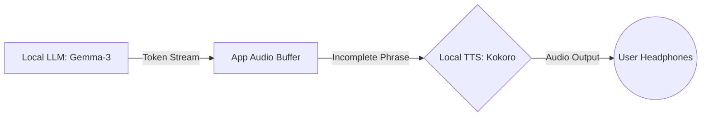

# Local AI Architecture: The Local Guardian (TTS)

## 1. Role & Objective
The Local TTS is the **Emotive Voice** of the Pocket Secure Base. Its primary objective is to deliver high-quality, natural-sounding audio instructions without an internet connection. 

While the Cloud TTS provides the primary voice for general navigation, the Local TTS is the **fail-safe voice** that ensures the user is never left in "silence" during a sensory crisis or in a dead zone.

---

## 2. Technical Stack
- **Model**: `Kokoro-82m` (Ultra-lightweight neural TTS).
- **Weights**: `Kokoro-J` (Specifically optimized for Japanese phonemes and accent).
- **Inference Runtime**: `onnxruntime_flutter` or native Swift/Kotlin bindings.
- **Latency**: Sub-100ms inference time (near-instantaneous).

---

## 3. The "Guardian" Audio Workflow
The Local TTS is designed to stream audio from the Local LLM (`Gemma-3-1b`) in a tight, parallel loop.

1.  **Direct Streaming**: Tokens from the Local LLM are passed immediately to the TTS engine to minimize latency.
2.  **Phrase-Level Synthesis**: The TTS synthesizes audio as soon as it has a meaningful phrase, ensuring natural prosody (pitch and rhythm).
3.  **Low Latency Playback**: The app starts playing audio while the next part of the sentence is still being synthesized.

---

## 4. Why "Local" Voice Matters?
| Benefit | Impact for Neurodivergent Users |
| :--- | :--- |
| **No "Robot" Voice** | Standard system TTS often sounds mechanical and can be a sensory trigger. Kokoro-82m provides a human-like, calm tone. |
| **Immediate Response** | In a panic, even a 2-second cloud delay can feel like an eternity. Local TTS responds instantly to sensor triggers. |
| **Zero-Data Safety** | Guarantees that the "Secure Base" voice stays active in subways, elevators, and remote areas. |
| **Calm Tone Profile** | Specifically uses a "low-arousal" voice model to help ground the user during high-stress moments. |

---

## 5. Performance & Resource Constraints
| Metric | Target | Mitigation |
| :--- | :--- | :--- |
| **Response Latency** | < 200ms (Total) | Parallelizing LLM token generation with TTS synthesis. |
| **Battery Impact** | Low | Leverages hardware-accelerated ONNX runtime for efficient power usage. |
| **Memory Footprint** | ~150-300MB | Only loaded when the trip starts and the user has opted-in. |

---

## 6. Summary & Fallback
The Local TTS is the **Guardian's Voice**. 
- **Normal Flow**: The app uses Cloud TTS for its superior fidelity.
- **Crisis/Dead-Zone Flow**: The app seamlessly switches to **Kokoro-82m** to maintain the user's connection to the "Secure Base" without interruption.
