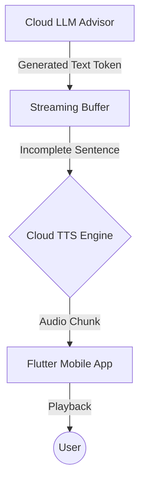

# Cloud AI Architecture: The Cloud TTS Service

## 1. Role & Objective
The Cloud TTS Service provides the **high-quality, emotive "Voice of the Guardian"** for the Pocket Secure Base. 

While the Local TTS (Kokoro-82m) is optimized for speed and offline reliability, the Cloud TTS is optimized for **fidelity, emotional nuance, and low-bandwidth streaming**. It is the default voice service when the user has a strong internet connection.

---

## 2. Technical Stack
- **Model Choice**: OpenAI TTS-1, ElevenLabs (Multilingual), or Google Cloud Neural2.
- **Tone Profile**: Calm, neutral-warm, and low-stimulation.
- **Format**: **Opus** or **MP3** via HTTP streaming to minimize "Time-to-First-Audio."

---

## 3. Real-Time Streaming Workflow
To achieve sub-second responsiveness, the Cloud TTS uses a **Parallel Streaming Workflow**:

1.  **Tokenization**: As the Cloud LLM generates tokens, they are sent to the TTS service in chunks.
2.  **Streaming**: The TTS service begins converting text to audio *before* the full sentence is finished.
3.  **Low Latency**: The app's audio player begins playback as soon as the first chunk arrives.

---

## 4. Why Use Cloud TTS?
| Benefit | Description |
| :--- | :--- |
| **High Fidelity** | Neural voices sound more "human" and less "robotic," which is critical for users who find synthetic voices overstimulating. |
| **Zero Battery Impact** | All processing happens on the server, saving the mobile device's CPU/GPU/NPU for sensors and local monitoring. |
| **No Storage Cost** | Does not require the ~100MB-500MB download required by high-quality local TTS models. |
| **Multilingual Nuance** | Better handles complex Japanese pronunciations of station names and specific transit terms. |

---

## 5. Summary & Fallback Logic
The Cloud TTS is the **Primary Voice Engine**. 
- **If Connection Weakens**: The app seamlessly switches to the **Local TTS (The Guardian)** to ensure instructions are never cut off mid-sentence.
- **If Battery < 15%**: The app may force Cloud TTS to preserve the device's remaining power for critical safety monitoring.
