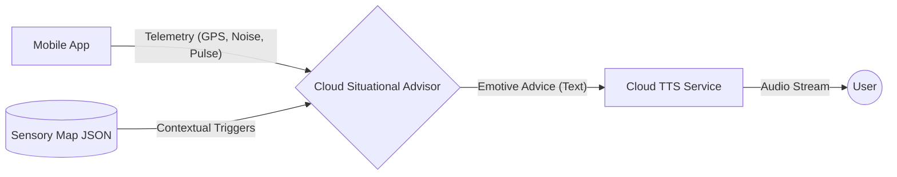

# Cloud AI Architecture: The Situational Advisor (Phase 2)

## 1. Role & Objective
The Situational Advisor is the **Cloud AI component** responsible for providing real-time, emotive verbal guidance during navigation when a strong internet connection is available. 

Unlike the Strategic Planner (Phase 1), which is an agentic researcher, the Situational Advisor is a **reactive monitor** that interprets real-time context to provide immediate comfort and direction.

---

## 2. Input/Output Data Flow
The advisor receives a continuous stream of telemetry from the mobile app and responds with verbal advice to be streamed through the Cloud TTS.



---

## 3. Real-Time Inference Logic
The Advisor uses a high-context LLM (e.g., Gemini 1.5 Flash) to analyze the following data points:
- **GPS Coordinates**: To know the user's progress relative to the "Sensory Map."
- **Ambient Noise (dB)**: To detect sudden volume spikes that might trigger stress.
- **Heart Rate/Pulse (Optional)**: To monitor for physical signs of anxiety.
- **Route State**: To understand if the user is on track or has diverged into an unplanned area.

### Example Logic (Pseudocode):
```python
if current_location.is_near(sensory_map['high_noise_zone']):
    if ambient_noise > 80:
        return "I can hear it's getting loud. Keep walking for 20 more meters, and we'll reach a quiet corner. You're doing great."
```

---

## 4. Key Performance Indicators (KPIs)
| Metric | Target | Mitigation |
| :--- | :--- | :--- |
| **Response Latency** | < 1.5s (End-to-End) | Use parallel streaming to TTS and optimized backend proxies. |
| **Tone of Voice** | Calm & Encouraging | Use specific system prompting ("You are a senior social worker; be calm and non-judgmental"). |
| **Safety Integrity** | 100% Connectivity Aware | If latency increases or connection drops, hand over immediately to the **Local Guardian**. |

---

## 5. Strategic Advantage
- **Memory Management**: Offloads the heavy "empathy" and complex context reasoning from the mobile device to the cloud.
- **Dynamic Content**: Can pull in real-time news or transit updates (e.g., "A train just arrived, expect more people on the street for the next 2 minutes").
- **Cost Efficiency**: Only invoked when the user is in a "high-complexity" area, saving tokens during simple walks.
