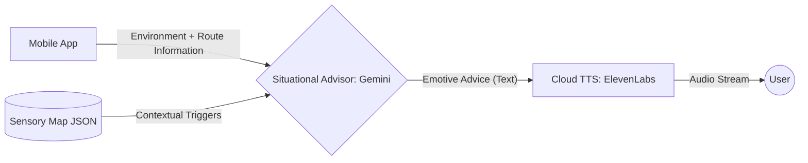

# Cloud AI Architecture: The Situational Advisor (Phase 2)

## 1. Role & Objective
The Situational Advisor is the **Cloud AI component** responsible for providing real-time, emotive verbal guidance during navigation when a strong internet connection is available. 

Unlike the Strategic Planner (Phase 1), which is an agentic researcher, the Situational Advisor is a **reactive monitor** that interprets the current environment and route state to provide immediate comfort and direction.

---

## 2. Input/Output Data Flow
The advisor receives telemetry (Environment + Route Information) from the mobile app and responds with emotive advice to be streamed through Cloud TTS.



---

## 3. Real-Time Inference Logic
The Advisor uses **Gemini 2.0 Flash-Lite** to analyze the following data points:
- **GPS Coordinates**: To monitor the user's progress relative to the "Sensory Map."
- **Ambient Noise (dB)**: To detect sudden volume spikes.
- **Route State**: To understand if the user has diverged or is facing an upcoming strategic hazard detected by the **Event Scout (Batch)**.

### Example Logic (Pseudocode):
```python
if current_location.is_near(sensory_map['high_noise_zone']):
    if ambient_noise > 80:
        return "I can hear it's getting loud. Keep walking for 20 more meters, and we'll reach a quiet corner. You're doing great."
```

---

## 4. Key Performance Indicators (KPIs)
| Metric | Target | Mitigation |
| :--- | :--- | :--- |
| **Response Latency** | < 1.5s (End-to-End) | Use **ElevenLabs Flash** for near-instant streaming as the LLM generates text. |
| **Tone of Voice** | Calm & Encouraging | Utilize Gemini's linguistic flexibility to maintain a "Senior Social Worker" persona. |
| **Safety Integrity** | 100% Connectivity Aware | If latency increases or connection drops, hand over immediately to the **Reflex Engine (Local)**. |

---

## 5. Strategic Advantage
- **Memory Management**: Offloads complex context reasoning from the device to the cloud.
- **Dynamic Content**: Processes real-time news/transit updates provided by the **Event Scout (Batch)**.
- **Cost Efficiency**: Utilizes the budget-friendly **Gemini 2.0 Flash-Lite** to handle frequent situational updates.
