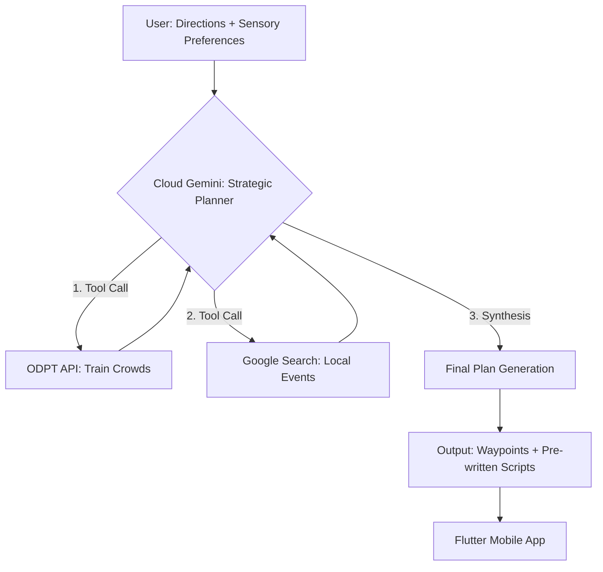

# Cloud AI Architecture: The Strategic Agent (Planning Phase)

## 1. Role & Objective
The Cloud AI acts as the **Strategic Planner** for the Pocket Secure Base. Its primary goal is to transform a user request and their specific sensory preferences (Noise, Crowd, Light) into a detailed, sensory-aware navigation plan. 

While the Local AI handles "Tactical" immediate safety via the Reflex Engine, the Cloud AI handles the "Strategic" deep-reasoning tasks and pre-writes the guidance scripts used by the app during offline or high-stress moments.

---

## 2. The Agentic Workflow
The Cloud AI employs an **Agentic Loop** (Reason -> Act -> Observe). It investigates the environment using external tools and the user's sensory profile before finalizing the plan.



---

## 3. Strategic Tools (Function Calling)
The LLM is equipped with specialized functions to "see" the current state of the city:

| Tool Name | Parameters | Description |
| :--- | :--- | :--- |
| `get_transit_status` | `line_name`, `station` | Accesses Tokyo Metro GTFS-RT (ODPT) to check for delays and platform crowding. |
| `search_local_events` | `location`, `date` | Uses Google Search to identify festivals, construction, or protests that create noise/crowds. |
| `get_sensory_data` | `coordinates` | Queries the proprietary sensory database for permanent triggers (echoing tunnels, loud AC exhausts). |
| `calculate_quiet_route` | `origin`, `destination` | Performs initial pathfinding with weightings for user-specific sensory preferences. |

---

## 4. Output: The "Strategic Handover"
The final result of the Strategic Planning phase is a structured payload sent to the mobile app, containing two core components:

### A. The Navigation URL
A Google Maps URL optimized with **Tactical Waypoints** to force the native maps app to stick to the quiet path identified by the LLM.

### B. The Sensory Map & Scripts (JSON)
A list of specific coordinates where the **Reflex Engine** should trigger interventions, along with pre-written scripts to be played if the situational context matches.
```json
{
  "sensory_map": [
    {
      "lat": 35.7135,
      "lng": 139.7766,
      "type": "noise_risk",
      "instruction_asset_id": "SENSORY_SHIELD_01",
      "script_text": "Construction site nearby. Stay on the right side of the street."
    }
  ]
}
```

---

## 5. Implementation Stack
- **Model**: Gemini 2.0 Flash (for speed and native tool-use).
- **Framework**: LangGraph or FastAPI for orchestrating the tool-calling loop.
- **Latency Target**: < 5 seconds for full strategic analysis and route generation.
